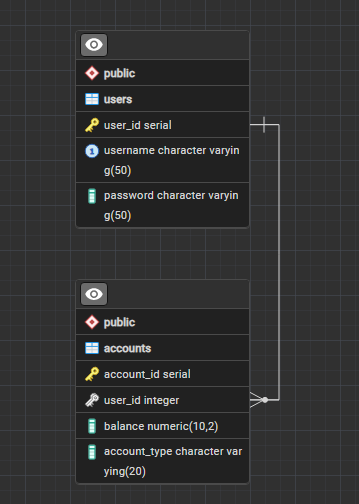

### Setting up .env file
```
JDBC_URL=jdbc:postgresql://postgres-server:5432/postgres
JDBC_USERNAME=postgres
JDBC_PASSWORD=XXXXXXX

DB_USER=postgres
DB_PASSWORD=XXXXXXX
DB_NAME=postgres

SECRET_KEY=XXXXXXXXXXXXXXXXXXXXXXXXXXXXXXXXXXXXXXXXX
```

### Setting up connection to postgresql database
- At the file: `src/main/resources`, the `application.properties` file sets up the db connection and secret key
- using `${}`, we pull values from `.env`
- Secret key should be long enough to be secure
- Should follow the format:
```
secret.key=${secret.key}
jdbc.url=${jdbc.url}
jdbc.username=${jdbc.username}
jdbc.password=${jdbc.password}
```

### Commands used
- mvn clean package //recreate .jar file to be packaged in docker image
- docker-compose up --build //build the docker containers for the java backend and postgresql along with a volume
- docker-compose down -v //takes down the docker containers along with the volume
- docker build -t javalinbank . //build the java backend container by itself

### wait-for-it.sh
- a bash script from https://github.com/vishnubob/wait-for-it
- used in dockerfile for java backend
- waits for postgresql container to initialize before running java container

### Database for postgres
- There is a one-to-many relationship between two tables: `users`, `accounts`
- `docker-compose.yml` file uses the `init/setup.sql` file to create tables
```
CREATE TABLE IF NOT EXISTS users (
    user_id SERIAL PRIMARY KEY,
    username VARCHAR(50) UNIQUE,
    password VARCHAR(50)
);

CREATE TABLE IF NOT EXISTS accounts (
    account_id SERIAL PRIMARY KEY,
    user_id INT UNIQUE,
    balance DECIMAL(10, 2) CHECK (balance >= 0),
    account_type VARCHAR(20) NOT NULL,
    FOREIGN KEY (user_id) REFERENCES users(user_id) ON DELETE CASCADE
);
```
### Entity Relationship Diagram for this Backend


## Endpoints for users:
<hr/>

#### `/get_accounts_by_user_id` `GET` `Requires Jwt`
- Uses jwt payload to get user_id
- returns a list of accounts for the user
#### `/get_all_users` `GET`
- returns all users
#### `/register/{accountType}` `POST`
- path param for accountType takes in a String for the type of account wanted: "Checking", "Savings", "Roth IRA", etc. Would probably be an enum if I continued working on this.
- request body is in the format: **username (String)**, **password (String)**
`{"username":"XXXXXX","password":"XXXXXX"}`
<hr/>

## Endpoints for accounts:
<hr/>

#### `/view_balance` `POST` `Requires Jwt`
- request body is in the format: **accountId (Integer)**
  `{"accountId":"XXXXXX"}`
#### `/withdraw` `POST` `Requires Jwt`
- request body is in the format: **accountId (Integer)**, **amount (BigDecimal)**
  `{"accountId":"XXXXXX","amount":"XXXXXX"}`
#### `/deposit` `POST` `Requires Jwt`
- request body is in the format: **accountId (Integer)**, **amount (BigDecimal)**
  `{"accountId":"XXXXXX","amount":"XXXXXX"}`
<hr/>

## Endpoints for auth:
<hr/>

#### `/login` `POST`
- request body is in the format: **username (String)**, **password (String)**
  `{"username":"XXXXXX","password":"XXXXXX"}`

